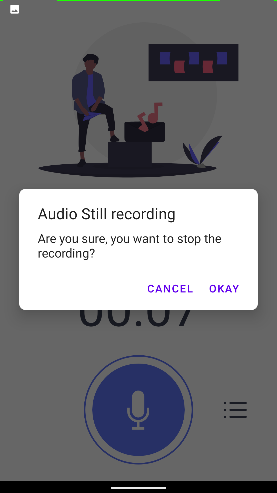
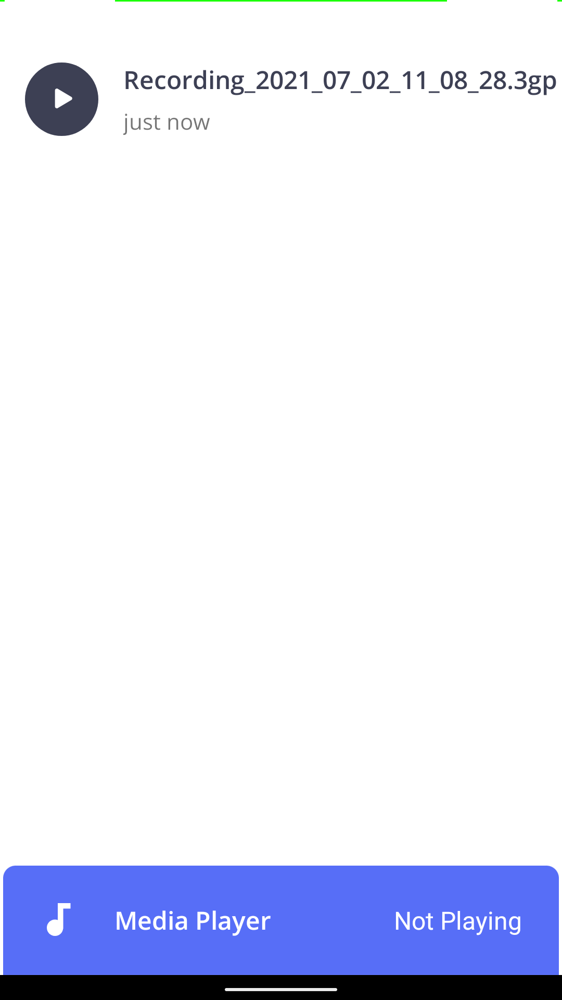

# VoiceRecoder
VoiceRecoder is an Android app in which users can record the voice and play it after inside the app only. This repository is made for the purpose to showcase my project for learning purposes and should not be used commercially.

# Features

1. User can record the voice.
2. User can play the voice inside the app.
3. User can pause and resume the recording of the audio.

The app is designed with Google Material Design that supports the Android versions from Kitkat 4.4.0 to Android 11.

# Screenshots

 Main Screen while recording audio.            |  Main Screen While switching to different Activity.        
:---------------------------------------------:|:--------------------------------------------------:
 |  

 List of Recorded Audio. | Playing Recorded Audio
:-----------------------:|:--------------------------------------------------:
|  

# I also highly recommend you to suggest some improvements in the project.
